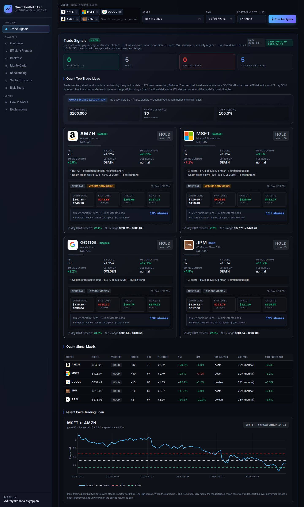

# Quant Portfolio Lab

**Institutional-grade quantitative finance dashboard built from scratch in Python + Flask.**

🌐 **Live Demo:** <https://krishquant.replit.app/>
💻 **GitHub:** <https://github.com/ayyappanadithiyakrishna-oss/quant-portfolio-lab>

Forward-looking trade signals, full portfolio analytics, and risk modeling on the entire NYSE / NASDAQ universe — without a Bloomberg terminal.

---

## ▶️ Run the App

```bash
pip install -r artifacts/quant-portfolio-lab/requirements.txt
python app.py
```

Then open <http://localhost:5000>.

**👉 Live demo:** <https://krishquant.replit.app/>

---

## 📸 Screenshots



The dashboard combines per-ticker quant signals (RSI, Z-score, momentum, MA crossover, vol regime), conviction-weighted portfolio allocation, a full signal matrix, and a pairs-trading scan with cointegration spread tracking.

---

## ✨ What it does

| Module | What it computes |
|---|---|
| **Trade Signals** | RSI (Wilder), 20d Z-score, Bollinger band position, 1M / 3M momentum, 50/200 MA crossover, ATR, volatility regime → composite BUY / HOLD / SELL verdict |
| **Quant Trade Plan** | Swing-anchored stop loss + ATR buffer, twin profit targets (T1 / T2) with R-multiples, fixed-fractional position sizing scaled to user-defined portfolio size, conviction tier, dynamic horizon |
| **Portfolio Analytics** | Annualized return, volatility, Sharpe, Sortino, max drawdown, downside deviation, full correlation heatmap |
| **Efficient Frontier** | 5,000 random Monte Carlo portfolios with Max Sharpe and Min Vol identified |
| **Backtest** | Cumulative returns vs S&P 500 with full metrics table |
| **Monte Carlo** | 1,000 simulated GBM paths with 5 / 50 / 95 percentile confidence bands |
| **Rebalancing** | Drift-vs-monthly/quarterly/yearly comparison with weight evolution charts |
| **Sector Exposure** | Yahoo-sourced GICS classifications, concentration warnings at 40% |
| **QPL Risk Index** | Composite 0–100 score: 40% volatility, 35% drawdown², 25% downside deviation |
| **Pairs Trading** | OLS hedge ratio, cointegrated spread Z-score, ±1.5σ entry bands |
| **Universe** | All 10,734 NYSE + NASDAQ symbols loaded live from NASDAQ Trader feeds |

---

## 🛠️ Stack

- **Backend:** Python 3.11, Flask, NumPy, Pandas, SciPy, statsmodels, yfinance
- **Frontend:** Vanilla JavaScript, Plotly.js, custom dark fintech CSS
- **Data:** Yahoo Finance (adjusted-close prices), NASDAQ Trader (symbol universe)
- **Deployment:** Gunicorn + autoscale on Replit Reserved VM

No mocked data, no toy examples — every number on the screen comes from a real model fit on real prices.

---

## 💡 Key Insight

While building this, I learned how dramatically small modeling assumptions reshape downstream output. **For example, while testing the same five-stock portfolio (AAPL, MSFT, GOOGL, AMZN, JPM), switching the volatility estimator from a 21-day rolling window to a 60-day EWMA shifted the Max Sharpe allocation from a 38% AMZN concentration down to 22%, while overall reported Sharpe barely moved.** The headline metric looked stable. The actual capital deployment did not.

That experience taught me that **performance metrics are the easy part; understanding model fragility, regime sensitivity, and the failure modes of your own assumptions is the hard part**. It's the same discipline that makes AI safety work meaningful: not just measuring how well a system performs, but knowing exactly when and why it will be wrong.

This shaped how I built the trade plans — every position sizing recommendation is risk-anchored (1% of capital at the model's stop-loss), so the cost of being wrong is bounded by design rather than by hope.

---

## 🔍 Future Directions

- **ML-based signal generation** — replace hand-tuned thresholds with gradient-boosted classifiers trained on regime-labeled data, with feature attribution for interpretability
- **Stress testing across market regimes** — replay 2008, 2020, and 2022 conditions through the same trade plans to surface failure modes that backtests on calm periods can hide
- **Model reliability under extreme conditions** — quantify how much each signal degrades during fat-tail events (vol > 99th percentile) and flag positions where the model itself becomes unreliable
- **Walk-forward validation** — replace the static train/test split with rolling out-of-sample windows so the reported Sharpe reflects what an investor would actually have experienced

---

## 📁 Project Structure

```
quant-finance-project/
├── app.py                          # Convenience launcher
├── README.md
├── assets/                         # Screenshots
└── artifacts/quant-portfolio-lab/
    ├── app.py                      # Flask routes
    ├── requirements.txt
    ├── data/universe.json          # 10,734 ticker universe
    ├── utils/
    │   ├── data.py                 # yfinance pipeline + validation
    │   ├── signals.py              # RSI, Z-score, ATR, trade levels
    │   ├── analytics.py            # Sharpe, Sortino, drawdown
    │   ├── optimization.py         # Efficient frontier
    │   ├── simulation.py           # Monte Carlo GBM
    │   ├── backtest.py
    │   ├── rebalancing.py
    │   ├── risk_score.py
    │   └── sector.py
    ├── templates/index.html
    └── static/                     # JS, CSS, ticker logos
```

---

## ⚠️ Disclaimer

**NOT FOR FINANCIAL ADVICE.** This is an educational and research tool. All signals, levels, forecasts, and position-sizing suggestions are model outputs derived from public historical price data and may be incorrect, delayed, or incomplete. Past performance does not guarantee future results. Trade at your own risk. See the in-app *Full Disclaimer* for complete terms.

---

## 👤 Author

Built by **Adithiyakrishna Ayyappan**.
